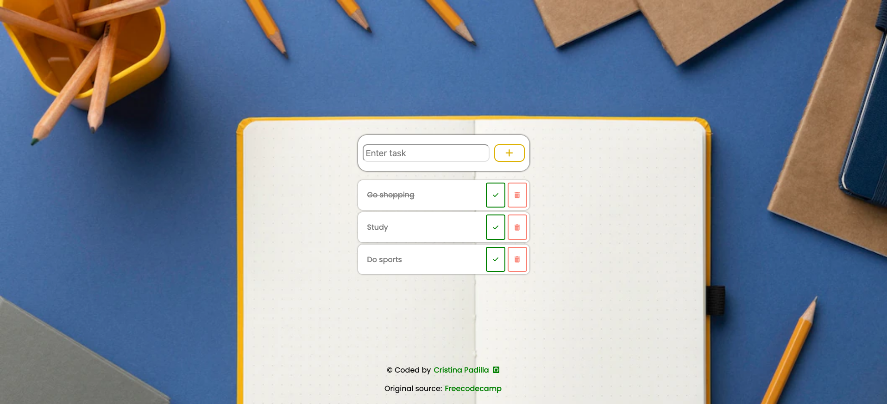

# DOM Manipulation: ToDo List

## Overview

## The challenge

This is the last challenge from the [Freecodecamp](https://www.youtube.com/watch?v=5fb2aPlgoys&t=2909s) DOM manipulation tutorial.
The challenge consist of a todo list that allows the user to add, check and delete tasks.

### Links

- Solution [here](https://phenomenal-pasca-d2aa15.netlify.app/)

### Built with

- Semantic HTML5 markup
- CSS custom properties & flexbox
- JavaScript

### What I learned

Thanks to this tutorial I have learnt and practised the following DOM manipulation concepts:
- getElementsByClassName()
- addEventListener()
- e.target
- appendChild()
- createElement()
- parentElement()
- remove()
- classList.add()

Would you like to know what the DOM is and what other concepts exist to manipulate and make cool and fun interactions? I have created 2 tutorials to explain and put in practise all concepts. Check them out:
- [DOM manipulation I: what is the DOM? Selectors, styling, text modifiers & events](https://www.cristina-padilla.com/dom1.html).
- [DOM manipulation II: How to create and remove elements & manipulate classes and attributes](https://www.cristina-padilla.com/dom2.html).

## Author

- Website - [www.cristina-padilla.com](https://www.cristina-padilla.com)
- Original source - [Freecodecamp](https://www.youtube.com/watch?v=5fb2aPlgoys&t=2909s)
- Twitter - [@crispitipina](https://www.twitter.com/crispitipina)

